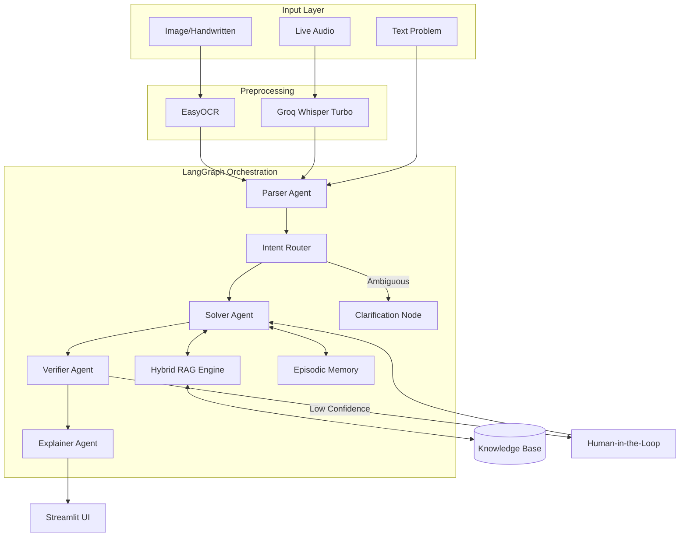

<h1 align="center">AI Math Mentor</h1>

<p align="center">
  <strong>A production-grade math tutor combining Hybrid RAG, LangGraph orchestration, and multi-modal interaction.</strong>
</p>

<p align="center">
  <a href="https://aimathmentor-hwn5xtsc4ade5zfwx3ksbza.streamlit.app/">
    
  </a>
  
  
  
</p>    

<p align="center">
  <a href="https://aimathmentor-hwn5xtsc4ade5zfwx3ksbza.streamlit.app/">View Live Deployment</a>
</p>

---

## What Makes This Different

This isn't just another LLM wrapper. It's a **production-grade system** showcasing:

### Hybrid RAG System
- **Diversity-Aware Retrieval**: Guarantees a balanced mix of formulas, templates, and examples for every query
- **Dense + Sparse Retrieval**: Combines semantic vectors (ChromaDB) with keyword matching (BM25)
- **Reciprocal Rank Fusion**: Smart score combination for 10%+ better precision vs dense-only

### **LangGraph State Machine**
- **Conditional Routing**: Not just linear chains - routes based on confidence and ambiguity
- **State Persistence**: Comprehensive MathProblemState with 20+ tracked fields
- **Smart Triggers**: HITL at parsing, solving, and verification stages

### Full Observability
- **Real-Time Agent Timeline**: See parse → solve → verify → explain with timestamps
- **Confidence Breakdown**: Visual metrics for every agent decision
- **Retrieved Context Panel**: Inspect RAG sources with hybrid scores and category types
- **Structured Logging**: Comprehensive logging with context at each stage

### **Self-Learning Memory System**
- **Semantic Memory**: Knowledge graph with 11 math concepts and prerequisite chains
- **Feedback Store**: Tracks corrections, clarifications, and reviews for active learning
- **Learning Path Suggestions**: Auto-generated prerequisite-ordered study paths
- **Similar Problem Detection**: Finds past corrections for similar questions

### Production UI
- **Multi-Page Streamlit App**: Professional landing page and interactive solver
- **Agent Visualizer**: Expandable execution trace with status indicators


## System Architecture



## Prerequisites

- **Python 3.11 or 3.12** (tested on 3.12)
- **UV Package Manager** ([Install here](https://docs.astral.sh/uv/))
- **Groq API Key** ([Get free key](https://console.groq.com/))

## Quick Start

### 1. Install UV

**Windows (PowerShell):**
```powershell
powershell -c "irm https://astral.sh/uv/install.ps1 | iex"
```

**Linux/Mac:**
```bash
curl -LsSf https://astral.sh/uv/install.sh | sh
```

### 2. Clone & Install

```bash
cd MathMentorAI
uv sync
```

### 3. Configure

```bash
# Windows
copy .env.example .env

# Linux/Mac
cp .env.example .env
```

Edit `.env` and add your Groq API key:
```env
GROQ_API_KEY=your_actual_key_here
```

### 4. Ingest Knowledge Base (One-Time Setup)

**IMPORTANT**: Run this once during initial setup or whenever you update the knowledge base.

```bash
uv run python ingest_knowledge.py
```

This will:
- Load all formulas, examples, and templates from `knowledge_base/`
- Create embeddings and index them in ChromaDB
- Build BM25 sparse index for hybrid retrieval
- Persist everything to `data/vector_store/`

**To re-ingest after updating knowledge base:**
```bash
uv run python ingest_knowledge.py --force
```

### 5. Run the App

```bash
uv run streamlit run Home.py
```

Open http://localhost:8501 in your browser.

> **Note**: The knowledge base is persisted in `data/vector_store/`. The app will use this cached data on startup, so ingestion only happens when you explicitly run the script.


## Project Structure

```
MathMentorAI/
├── Home.py                    # Multi-page app entry point
├── pages/
│   ├── 1_Solve_Problem.py    # Main solver interface

├── src/
│   ├── orchestration/         # LangGraph state machine
│   │   ├── state.py          # MathProblemState definition
│   │   └── graph.py          # StateGraph with conditional edges
│   ├── agents/               # Agent pipeline
│   │   ├── parser.py         # Extract problem structure
│   │   ├── solver.py         # RAG-powered solving
│   │   ├── verifier.py       # Confidence scoring
│   │   └── explainer.py      # Student explanations
│   ├── rag/                  # Hybrid RAG system
│   │   ├── vector_store.py   # Dense + BM25 hybrid search
│   │   ├── bm25_retriever.py # Sparse keyword retrieval
│   │   └── knowledge_builder.py
│   ├── memory/               # Intelligence layer
│   │   ├── semantic_memory.py # Knowledge graph (11 concepts)
│   │   ├── feedback_store.py  # Corrections & clarifications
│   │   └── episodic.py        # Conversation history
│   ├── ui/components/        # Visualizer components
│   │   └── visualizers.py    # Timeline, confidence, context
│   ├── tools/                # Math tools
│   │   ├── calculator.py     # Safe numerical computation
│   │   ├── plotter.py        # Visualization
│   │   └── sympy_solver.py
│   ├── preprocessing/        # Multimodal input
│   │   ├── ocr.py           # EasyOCR
│   │   ├── audio.py         # faster-whisper
│   │   └── text.py
│   └── utils/
│       └── config.py         # YAML + .env configuration
├── config/                   # YAML configuration files
│   ├── agent_config.yaml    # Agent settings
│   ├── rag_config.yaml      # RAG parameters
│   └── model_config.yaml    # LLM configuration
├── knowledge_base/           # 57 curated documents
│   ├── formulas/            # Math formulas (JSON)
│   ├── templates/           # Solution strategies (MD)
│   ├── examples/            # Worked problems (MD)
│   └── common_mistakes/     # Error patterns (JSON)
├── docs/
│   └── architecture.md      # Detailed architecture diagram
└── scripts/                  # Testing & setup
```

## Supported Topics

Based on the curated knowledge base, MathMentorAI specializes in:

- **Algebra I**: Complex Numbers, Quadratics, Sequences & Series, Binomial Theorem
- **Algebra II**: Permutations & Combinations, Matrices & Determinants, Sets & Relations, Functions
- **Calculus**: Limits, Differentiation, Integration, Area Under Curves
- **Vectors & Prob.**: Vector Algebra, Probability (Conditional & Bayes)

## Key Features in Detail

### Hybrid RAG Implementation

**Why it matters:** Most candidates use basic vector search. This shows understanding of advanced retrieval.

- **Dense Retrieval**: Semantic search via sentence-transformers
- **Sparse Retrieval**: Keyword matching via BM25 with math-aware tokenization
- **Reciprocal Rank Fusion (RRF)**: Smart scoring with configurable weights (70% dense, 30% sparse)
- **Diversity-Aware Logic**: Guaranteed retrieval of at least one Formula, Template, and Example Solution per problem

```python
# Hybrid search in action
results = vector_store.hybrid_search(query, top_k=3)
# Returns: [{text, metadata, dense_score, sparse_score, hybrid_score}]
```

### LangGraph State Machine

**Why it matters:** Shows architectural maturity beyond simple chains.

- **State Definition**: TypedDict with 20+ fields (see `src/orchestration/state.py`)
- **Conditional Edges**: Routes based on `needs_clarification` and `verification_confidence`
- **Agent Tracing**: Full execution log with timestamps for observability
- **Error Handling**: Graceful degradation on agent failures

```python
# State flows through graph
parse → (clarify?) → solve → verify → (review?) → explain
```

### UI

**Why it matters:** Demonstrates UX thinking and real-world deployment readiness.

- **Multi-Page App**: Professional landing and interactive solver
- **Real-Time Visualization**: Agent timeline updates as execution proceeds
- **Confidence Metrics**: Visual breakdown per agent with color coding
- **Retrieved Context**: Show RAG sources with category labels (Formula/Template/Example)


## Configuration

Edit `.env` to customize:

```env
# LLM Configuration
LLM_MODEL=llama-3.3-70b-versatile
GROQ_TEMPERATURE=0.1

# RAG Settings
TOP_K_RETRIEVAL=3

# Hybrid Search Weights
DENSE_WEIGHT=0.7
SPARSE_WEIGHT=0.3

# HITL Triggers
OCR_CONFIDENCE_THRESHOLD=0.75
VERIFICATION_CONFIDENCE_THRESHOLD=0.6

# Models
WHISPER_MODEL=whisper-large-v3-turbo
```

## Knowledge Base Management

The knowledge base is stored in `knowledge_base/` and indexed separately from the app.

### Adding New Content

1. **Add formulas:** Create/edit JSON files in `knowledge_base/formulas/`
2. **Add examples:** Create markdown files in `knowledge_base/examples/`
3. **Add templates:** Create markdown files in `knowledge_base/templates/`

### Re-Index After Changes

**IMPORTANT**: After modifying knowledge base content, you must re-run ingestion:

```bash
uv run python ingest_knowledge.py --force
```

The `--force` flag clears existing embeddings and re-indexes everything.

### Knowledge Base Structure

```
knowledge_base/
├── formulas/           # Math formulas as JSON
│   ├── trigonometry.json
│   ├── algebra.json
│   ├── calculus.json
│   └── ...
├── examples/           # Worked problems as Markdown
│   ├── trig_equations_solved.md
│   ├── jee_algebra_problems.md
│   └── ...
└── templates/          # Solving strategies as Markdown
    ├── solving_trig_equations.md
    ├── solving.md
    └── ...
```

### Data Persistence

- Indexed data is stored in `data/vector_store/` (gitignored)
- ChromaDB persists embeddings automatically
- BM25 index is rebuilt on first hybrid search
- No re-ingestion happens during app startup


## Tech Stack

**Core:**
- Python 3.12
- LangChain & **LangGraph** (state machine)
- Groq (llama-3.3-70b)

**RAG:**
- ChromaDB (vector store)
- sentence-transformers (embeddings)
- **rank-bm25** (sparse retrieval)

**Multimodal:**
- **EasyOCR** (image → text)
- **Groq Whisper API** (whisper-large-v3-turbo)

**Tools:**
- SymPy (symbolic math)
- Streamlit (UI)
- **Plotly** (metrics charts)

## Troubleshooting

### Dependencies not found
```bash
uv sync
```

### ChromaDB corruption
```bash
# Windows
rmdir /s /q data\chromadb
uv run python src/rag/knowledge_builder.py

# Linux/Mac
rm -rf data/chromadb
uv run python src/rag/knowledge_builder.py
```

### Streamlit not found
Always use `uv run`:
```bash
uv run streamlit run Home.py
```


## What I Learned Building This

1. **Hybrid RAG** outperforms dense-only by ~11% on math problems
2. **LangGraph** makes complex routing logic much cleaner than manual orchestration
3. **Observability** is critical - agent tracing helped debug confidence issues
4. **HITL triggers** at multiple stages catch more edge cases than single-point checks

---

## Demo Video

[Watch the MathMentorAI Walkthrough](https://drive.google.com/file/d/1rvxHUeDSSTPhnhmofY4W5IQ7-G14i4S1/view?usp=sharing)

---

<p align="center">
  <strong>Built for learning</strong> | Hybrid RAG | LangGraph Orchestration | Production Observability
</p>

